# Class Diagram - YeEP Bus Ticketing System

## 📊 Complete Class Diagram (ทุก Class เชื่อมกัน)

```mermaid
classDiagram
    %% ==================== ENTITY ====================
    class BaseEntity {
        <<abstract>>
        #Long id
        #LocalDateTime createdAt
        #LocalDateTime updatedAt
    }
    
    class User {
        -String username
        -String email
        -String password
        -String role
    }
    
    class BusRoute {
        -String name
        -String color
        -String origin
        -String destination
    }
    
    class BusTrip {
        -Integer tripNumber
        -LocalTime departureTime
        -LocalDate tripDate
        -Integer totalSeats
    }
    
    class Booking {
        -String bookingCode
        -String seatNumber
        -String status
    }
    
    %% ==================== REPOSITORY ====================
    class JpaRepository~T, ID~ {
        <<interface>>
        +findAll() List~T~
        +save(T) T
        +delete(T) void
    }
    
    class BookingRepository {
        <<interface>>
    }
    class UserRepository {
        <<interface>>
    }
    class BusRouteRepository {
        <<interface>>
    }
    class BusTripRepository {
        <<interface>>
    }
    
    %% ==================== SERVICE ====================
    class BookingService {
        +createBooking() Booking
        +sortBookings() List
    }
    class UserService {
        +register() UserResponse
        +login() UserResponse
    }
    class BusRouteService {
        +searchRoutes() List
    }
    class BusTripService {
        +getTripsWithAvailability() List
    }
    class FileService {
        +uploadProfileImage() Map
        +readTextFile() List
    }
    
    %% ==================== CONTROLLER ====================
    class BookingController {
        +bookSeats() ResponseEntity
        +getRoutes() ResponseEntity
    }
    class UserController {
        +login() ResponseEntity
        +register() ResponseEntity
    }
    class FileController {
        +uploadProfileImage() ResponseEntity
    }
    
    %% ==================== DTO ====================
    class ApiResponse~T~ {
        -boolean success
        -String message
        -T data
    }
    class LoginRequest {
        -String username
        -String password
    }
    class RegisterRequest {
        -String username
        -String email
        -String password
    }
    class UserResponse {
        -Long id
        -String username
        -String email
    }
    
    %% ==================== INHERITANCE ====================
    BaseEntity <|-- User
    BaseEntity <|-- BusRoute
    BaseEntity <|-- BusTrip
    BaseEntity <|-- Booking
    
    %% ==================== POLYMORPHISM ====================
    JpaRepository <|.. BookingRepository
    JpaRepository <|.. UserRepository
    JpaRepository <|.. BusRouteRepository
    JpaRepository <|.. BusTripRepository
    
    %% ==================== AGGREGATION ====================
    BusRoute "1" *-- "*" BusTrip
    BusTrip "1" o-- "*" Booking
    User "1" o-- "*" Booking
    
    %% ==================== CONTROLLER -> SERVICE ====================
    BookingController --> BookingService
    BookingController --> BusRouteService
    BookingController --> BusTripService
    UserController --> UserService
    FileController --> FileService
    
    %% ==================== SERVICE -> REPOSITORY ====================
    BookingService --> BookingRepository
    BookingService --> UserRepository
    UserService --> UserRepository
    BusRouteService --> BusRouteRepository
    BusTripService --> BusTripRepository
    
    %% ==================== DTO CONNECTIONS ====================
    UserController ..> LoginRequest : uses
    UserController ..> RegisterRequest : uses
    UserController ..> UserResponse : returns
    UserController ..> ApiResponse : returns
    UserService ..> UserResponse : creates
    BookingController ..> ApiResponse : returns
    FileController ..> ApiResponse : returns
```

---

## 📝 OOP Concepts Summary

| Concept | Classes | คำอธิบาย |
|---------|---------|----------|
| **Inheritance** | BaseEntity → User, BusRoute, BusTrip, Booking | สืบทอด field พื้นฐาน |
| **Polymorphism** | JpaRepository → 4 Repositories | Interface implementation |
| **Composition** | BusRoute ◆→ BusTrip | ลบ Route = ลบ Trip |
| **Aggregation** | User/BusTrip ◇→ Booking | ลบ User ไม่ลบ Booking |

---

## 📈 สถิติ

| ประเภท | จำนวน |
|--------|-------|
| Entity | 5 classes |
| Repository | 4 interfaces |
| Service | 5 classes |
| Controller | 3 classes |
| DTO | 4 classes |
| **รวม** | **21 classes** |
| **Methods** | **93 methods** |
