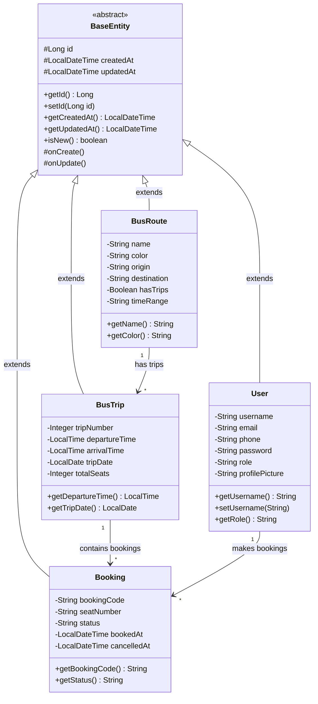
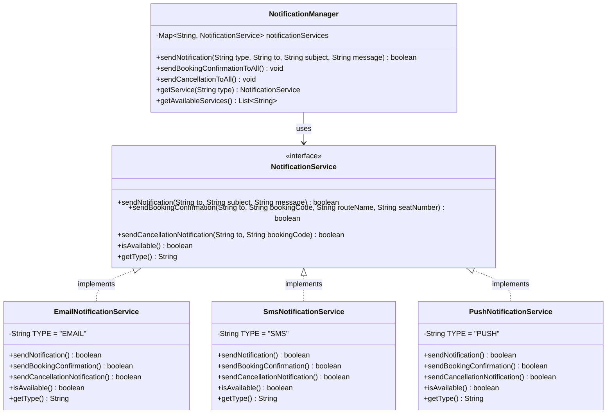
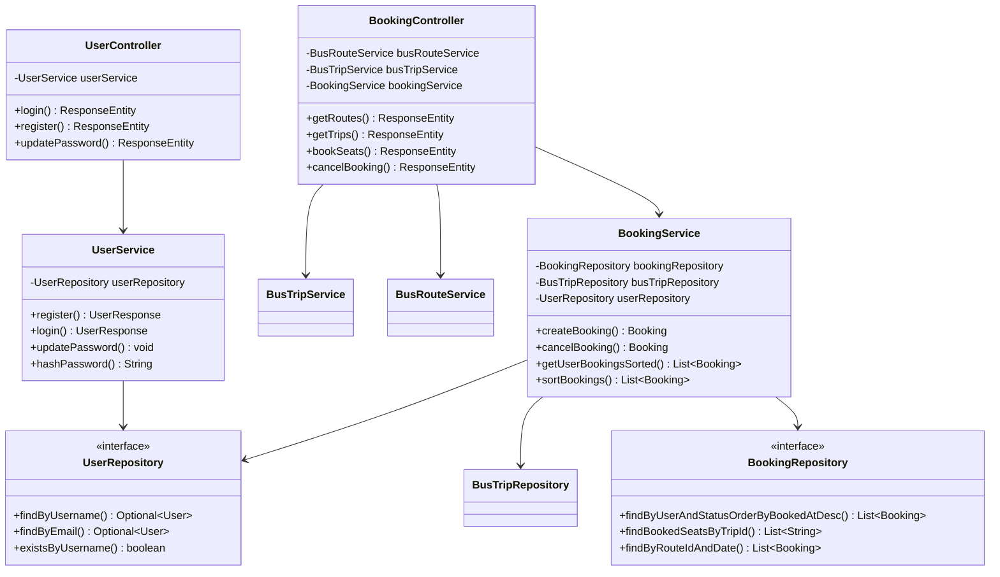

# Class Diagram - YeEP Bus Ticketing System

## 📊 ภาพรวม Entity และความสัมพันธ์

---

## 🔧 Service Layer - Polymorphism

---

## 📦 Complete Backend Architecture

---

## 📝 หมายเหตุ

### Inheritance (การสืบทอด)
- ทุก Entity (`User`, `BusRoute`, `BusTrip`, `Booking`) สืบทอดจาก `BaseEntity`
- `BaseEntity` เป็น abstract class ที่มี fields และ methods ที่ใช้ร่วมกัน

### Polymorphism (ความหลากหลายของรูปแบบ)
- `NotificationService` เป็น Interface
- มี 3 implementation: `EmailNotificationService`, `SmsNotificationService`, `PushNotificationService`
- `NotificationManager` ใช้ Polymorphism ในการจัดการ service ต่างๆ

### Aggregation/Composition
- `BusRoute` มี `BusTrip` หลายๆ ตัว (One-to-Many)
- `BusTrip` มี `Booking` หลายๆ ตัว (One-to-Many)
- `User` มี `Booking` หลายๆ ตัว (One-to-Many)
