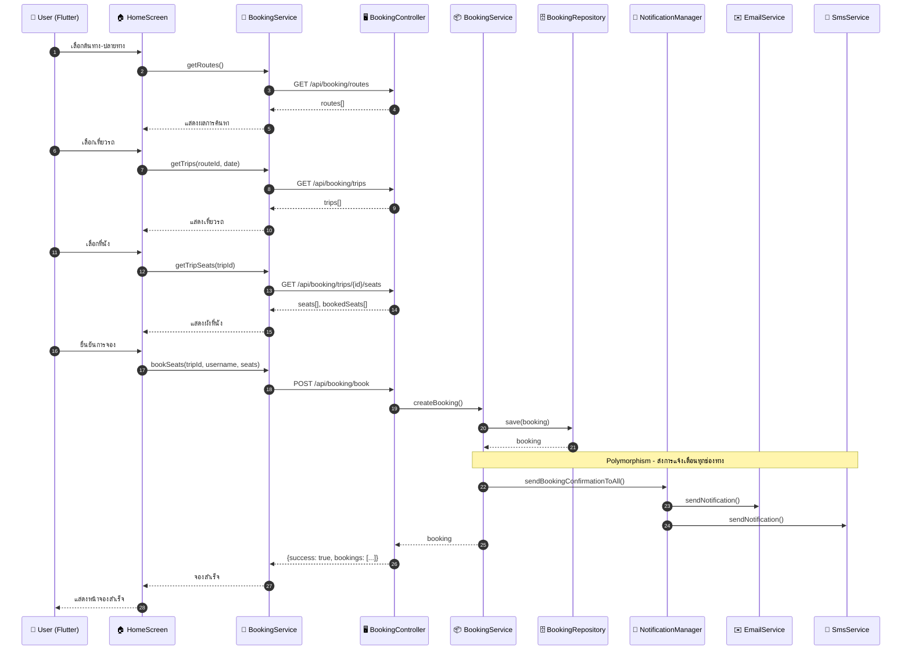
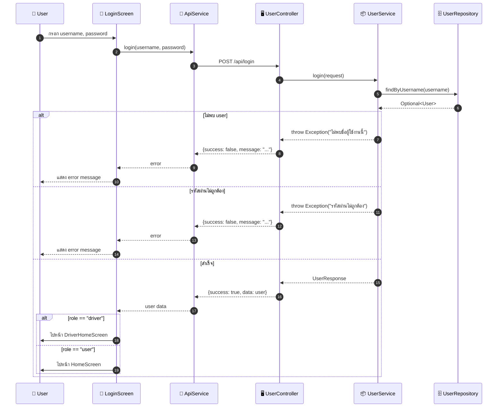
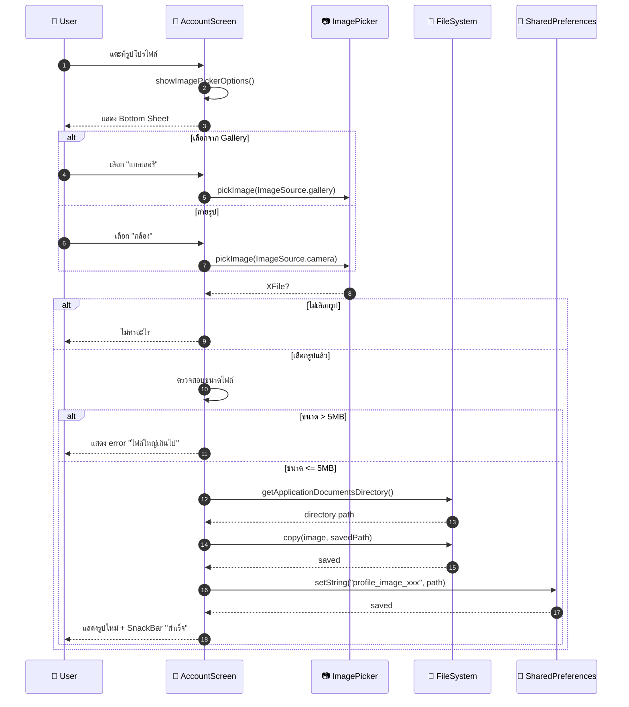
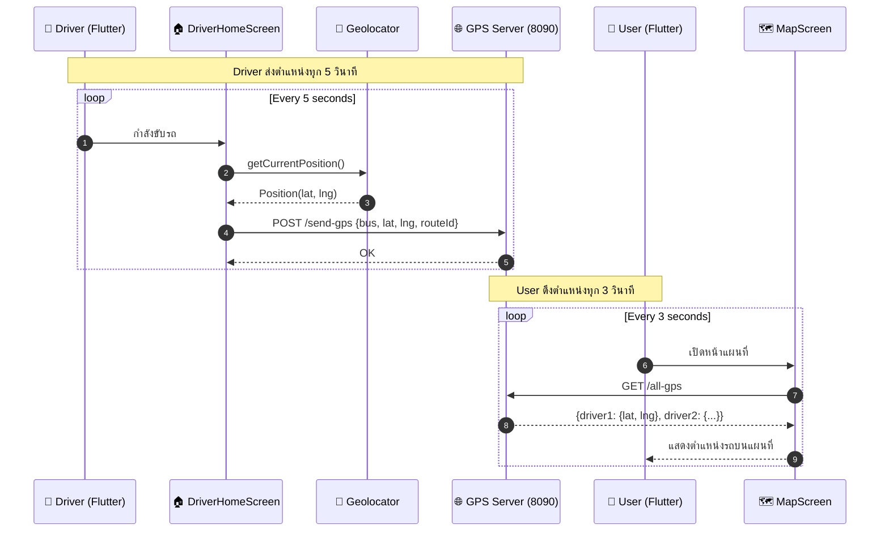
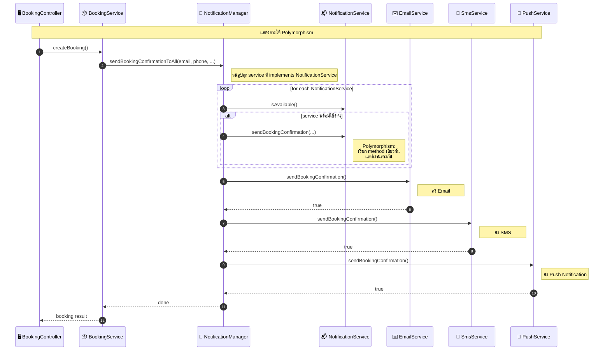

# Sequence Diagram - YeEP Bus Ticketing System

## 🎫 1. การจองตั๋ว (Booking Flow)

---

## 🔐 2. การเข้าสู่ระบบ (Login Flow)

---

## 🖼️ 3. การเปลี่ยนรูปโปรไฟล์ (File Input Flow)

---

## 📍 4. การติดตาม GPS (GPS Tracking Flow)

---

## 🔔 5. Polymorphism - Notification Flow

---

## 📝 หมายเหตุ

### การใช้ OOP Concepts

1. **Inheritance**: 
   - `User`, `Booking`, `BusRoute`, `BusTrip` สืบทอดจาก `BaseEntity`

2. **Polymorphism**: 
   - `NotificationService` interface มีหลาย implementation
   - `NotificationManager` เรียกใช้ผ่าน interface โดยไม่ต้องรู้ว่าเป็น implementation ไหน

3. **File Input**: 
   - `AccountScreen` รองรับการอัพโหลดรูปภาพจาก gallery/camera
   - ตรวจสอบขนาดไฟล์ไม่เกิน 5MB

4. **Data Sorting**: 
   - `BookingService.sortBookings()` ใช้ Comparator สำหรับเรียงลำดับข้อมูล
