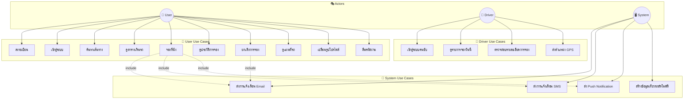
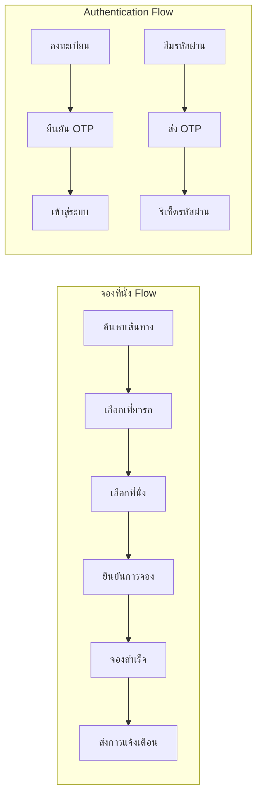

# Use Case Diagram - YeEP Bus Ticketing System

## 📊 Use Case Overview

---

## 📋 รายละเอียด Use Cases

### 👤 User Use Cases

| ID | Use Case | คำอธิบาย | Precondition | Postcondition |
|----|----------|----------|--------------|---------------|
| UC1 | ลงทะเบียน | ผู้ใช้สร้างบัญชีใหม่ | ยังไม่มีบัญชี | มีบัญชีในระบบ |
| UC2 | เข้าสู่ระบบ | ผู้ใช้ login เข้าระบบ | มีบัญชีอยู่แล้ว | เข้าสู่หน้าหลัก |
| UC3 | ค้นหาเส้นทาง | ค้นหาสายรถจากต้นทาง-ปลายทาง | เข้าสู่ระบบแล้ว | แสดงผลการค้นหา |
| UC4 | ดูตารางเดินรถ | ดูเวลาออกของสายรถ | เข้าสู่ระบบแล้ว | แสดงตาราง |
| UC5 | จองที่นั่ง | จองที่นั่งบนเที่ยวรถ | เลือกเที่ยวรถแล้ว | มีการจองในระบบ |
| UC6 | ดูประวัติการจอง | ดูรายการจองทั้งหมด | เข้าสู่ระบบแล้ว | แสดงรายการ |
| UC7 | ยกเลิกการจอง | ยกเลิกการจองที่มีอยู่ | มีการจองอยู่ | สถานะเปลี่ยนเป็น cancelled |
| UC8 | ดูแผนที่รถ | ดูตำแหน่งรถบนแผนที่ | เข้าสู่ระบบแล้ว | แสดงแผนที่ |
| UC9 | เปลี่ยนรูปโปรไฟล์ | อัพโหลดรูปโปรไฟล์ใหม่ | เข้าสู่ระบบแล้ว | รูปโปรไฟล์เปลี่ยน |
| UC10 | ลืมรหัสผ่าน | รีเซ็ตรหัสผ่านผ่าน OTP | มี email ในระบบ | รหัสผ่านถูกเปลี่ยน |

### 🚗 Driver Use Cases

| ID | Use Case | คำอธิบาย | Precondition | Postcondition |
|----|----------|----------|--------------|---------------|
| DC1 | เข้าสู่ระบบคนขับ | คนขับ login ด้วย role driver | มีบัญชีคนขับ | เข้าสู่หน้าคนขับ |
| DC2 | ดูรายการจองวันนี้ | ดูรายการจองในวันนี้ | เข้าสู่ระบบแล้ว | แสดงรายการจอง |
| DC3 | ตรวจสอบรายละเอียด | ดูรายละเอียดการจองแต่ละรายการ | เลือกการจอง | แสดงรายละเอียด |
| DC4 | ส่งตำแหน่ง GPS | ส่งพิกัดไปยัง GPS Server | กำลังขับรถ | ตำแหน่งอัพเดท |

### 🔔 System Use Cases

| ID | Use Case | คำอธิบาย | Trigger | Result |
|----|----------|----------|---------|--------|
| SC1 | ส่ง Email | ส่งการแจ้งเตือนผ่าน Email | มีการจอง/ยกเลิก | Email ถูกส่ง |
| SC2 | ส่ง SMS | ส่งการแจ้งเตือนผ่าน SMS | มีการจอง/ยกเลิก | SMS ถูกส่ง |
| SC3 | ส่ง Push | ส่ง Push Notification | มีการจอง/ยกเลิก | Notification ถูกส่ง |
| SC4 | สร้างเที่ยวรถ | สร้างเที่ยวรถสำหรับวันถัดไป | ทุกวัน | มีเที่ยวรถใหม่ |

---

## 🔗 Use Case Relationships

